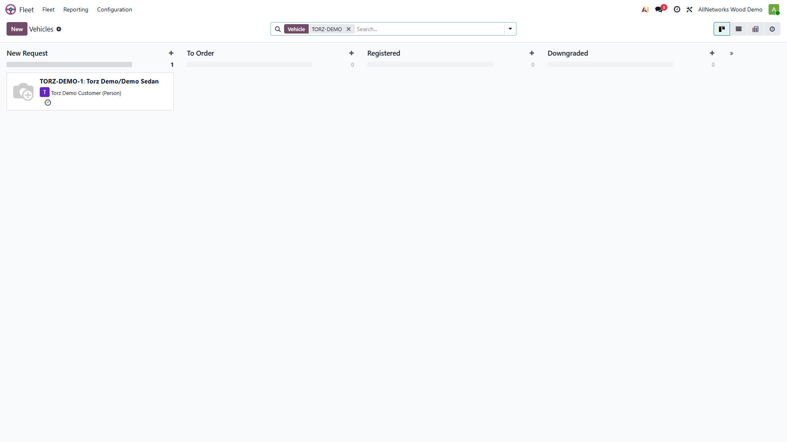
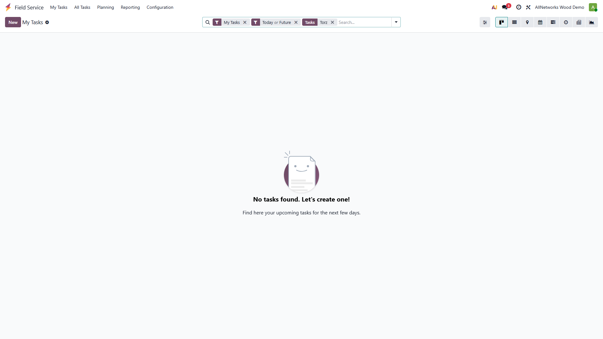
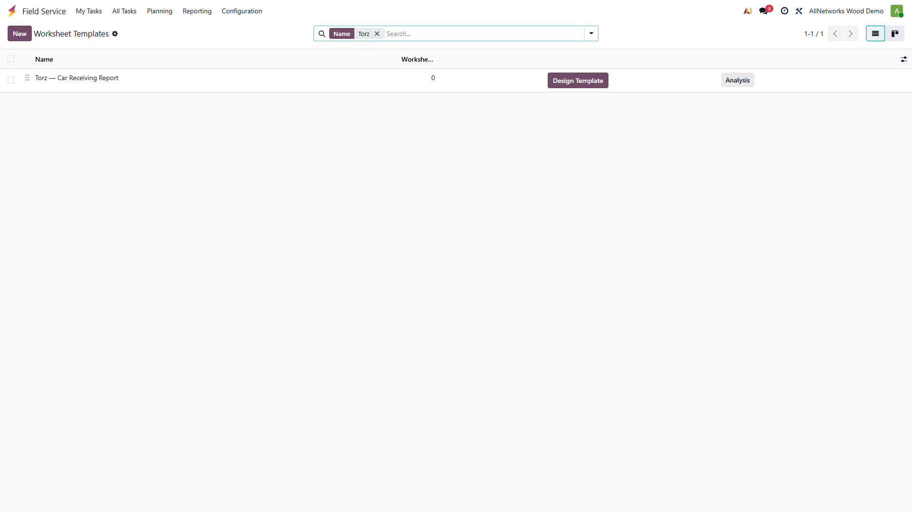
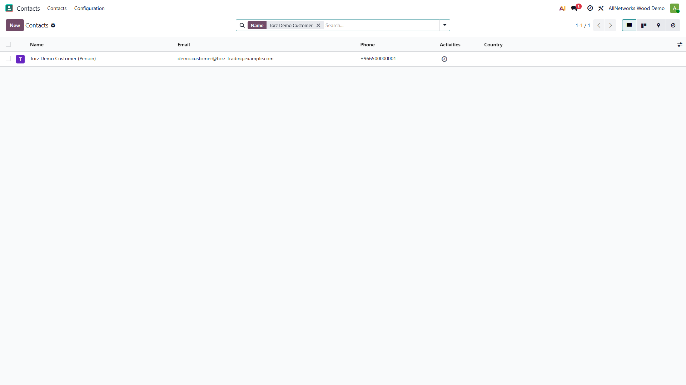

# Torz Trading — Phase 1 Standard Workflow (Visual Guide)

**Module:** `torz_phase1_workflow` | **Database:** `cleaning_demo` | **Odoo Enterprise 19**

Screenshots captured by Playwright from the live instance at `http://127.0.0.1:8069`.  
Regenerate at any time: see *How to regenerate* at the bottom.

---

## Step 1 — Logged-in shell

After login the Odoo home / app menu confirms the correct database and session.


---

## Step 2 — Fleet: customer vehicle list (filtered)

Vehicles for Torz live under **Fleet → Vehicles**.  
The demo vehicle **TORZ-DEMO-1** is seeded with plate, VIN, brand/model, colour, and the demo customer as driver.



---

## Step 3 — Products: Torz service products

Five service products are seeded:

| Product | Invoicing |
|---------|-----------|
| Paint Protection Film (PPF) | Timesheets delivered |
| Nano Ceramic Coating | Timesheets delivered |
| Window Tinting | Timesheets delivered |
| Windshield Protection | Timesheets delivered |
| Interior Protection | Timesheets delivered |

Each is linked to the **Torz Trading — Field Service** project so a confirmed SO line auto-creates a Field Service task.


---

## Step 4 — Inventory overview

Two warehouses support the material flow:

- **TMAIN** — Torz Main Warehouse (receive stock from vendors)
- **TOPRS** — Torz Cutting / Operations (daily internal transfer, consumption)


---

## Step 5 — Field Service: task list (job cards)

After a Sales Order is confirmed, a **Field Service task (job card)** is created automatically.  
Tasks travel through 7 stages:

> New → Vehicle Received → In Progress → Quality Check → Ready for Delivery → Delivered → Closed



---

## Step 6 — Field Service: project list + form

The **Torz Trading — Field Service** project is FSM-enabled, billable at task rate, timesheets on.


---

## Step 7 — Sales orders (workflow entry point)

Create a **Quotation**, add a Torz service line, **confirm** → Field Service task is generated.  
Invoice from the SO once timesheets are logged / task is delivered.


---

## Step 8 — Worksheet template: Car Receiving Report

The template **Torz — Car Receiving Report** is linked to `project.task`.  
Add checklist, image, signature, and notes fields in **Studio** on this template.



---

## Step 9 — Demo customer contact

The seeded **Torz Demo Customer** is the driver/owner for the demo Fleet vehicle.  
Use it for test quotations without polluting real customer data.




---

## End-to-end happy path (manual walkthrough)

1. Open **Fleet → TORZ-DEMO-1** — confirm vehicle details.
2. Create **Quotation** for *Torz Demo Customer*, add a Torz service line, **Confirm**.
3. Open the auto-created **Field Service** task → move to **Vehicle Received**.
4. Complete the **Car Receiving Worksheet** (add Studio fields for checklist/photos/signature).
5. Log **timesheets** or add **products on task** for material consumption.
6. Move task through stages to **Delivered**.
7. Back on the **Sales Order** → **Create Invoice** → **Register Payment**.
8. Check **Inventory** — receive stock into TMAIN, transfer to TOPRS, do adjustment.

---

## How to regenerate screenshots

```powershell
cd D:\odoo\odoo19\projects\bright_information\torz_trading\phase1_doc_playwright
$env:ODOO_PASSWORD = "admin"
npm run capture
```

---

*Next: Phase 2 — demo data module (sample SO, initial stock, warranty field seeds).*  
*Planning reference: `Automotive Protection & Tinting Center/planning/lazy_implementation_plan.md`*
