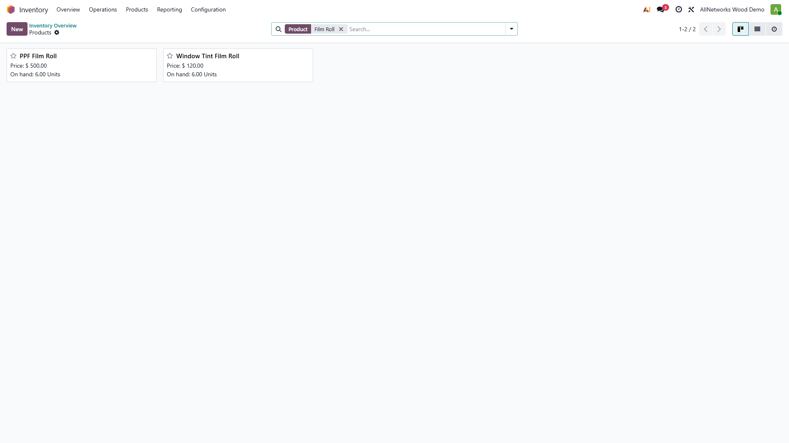
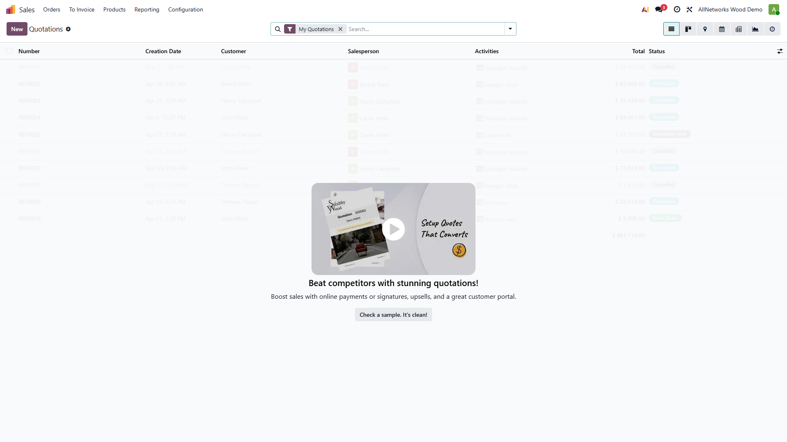
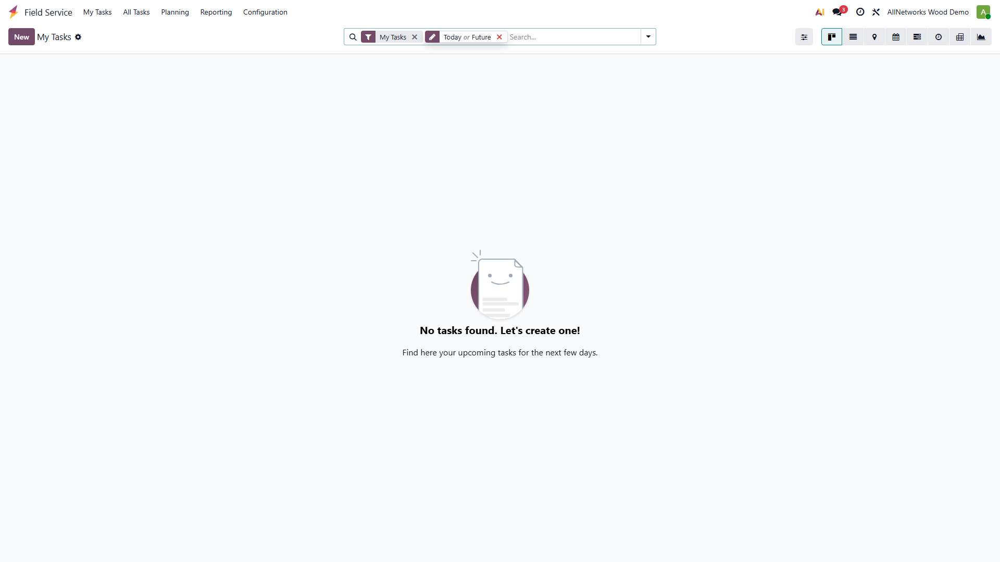
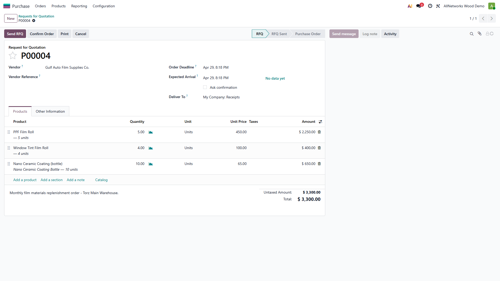

# Torz Trading — Phase 2 Demo Data Walkthrough

> **Module:** `torz_demo_standard_workflow`  
> **Depends on:** `torz_phase1_workflow` (Phase 1 — Standard Workflow)  
> **Database:** `cleaning_demo` (Odoo 19 Enterprise)  
> **Purpose:** Transactional demo data that makes the Phase-1 workflow fully demonstrable end-to-end.

---

## What Phase 2 adds

| Data layer | Records |
|---|---|
| Customers | Ahmed Al-Rashidi, Mohammed Al-Zahrani, Fahad Al-Otaibi |
| Vendor | Gulf Auto Film Supplies Co. |
| Fleet vehicles | SAR-1001 Sedan (Ahmed), SAR-2002 SUV (Mohammed), SAR-3003 Pickup (Fahad) |
| Stock lots | 3 × PPF-ROLL, 2 × TINT-ROLL |
| Opening stock (TMAIN) | 6 PPF rolls, 6 tint rolls, 10 ceramic bottles |
| Confirmed Sales Orders | S00011 (Ahmed — PPF), S00012 (Mohammed — Ceramic), S00013 (Fahad — Tinting) |
| FSM job cards | 1 per SO, pre-staged: Vehicle Received / In Progress / New |
| Draft Purchase Order | 5 PPF + 4 tint + 10 ceramic to Gulf Auto Film Supplies |

All of this is loaded automatically when the module is installed via a `post_init_hook` — no manual steps required.

---

## Regenerate screenshots

```powershell
cd torz_trading/phase2_doc_playwright
npm install
$env:ODOO_PASSWORD="admin"
npm run capture
```

Screenshots land in `phase2_workflow_docs/screenshots/`.

---

## Step-by-step walkthrough

### Step 1 — Login

After logging into Odoo 19, the home screen shows all installed apps.


---

### Step 2 — Demo Customers

Three Saudi customers are loaded: **Ahmed Al-Rashidi**, **Mohammed Al-Zahrani**, and **Fahad Al-Otaibi**. Each customer is linked to a fleet vehicle and a confirmed Sales Order.


---

### Step 3 — Customer Form (Ahmed Al-Rashidi)

Customer details include phone number, email, and address in Saudi Arabia.


---

### Step 4 — Fleet Vehicles

Three demo vehicles are registered, one per customer. Plate numbers follow the `SAR-XXXX` format for easy filtering.

| Plate | Model | Customer | Colour |
|---|---|---|---|
| SAR-1001 | Demo Sedan | Ahmed Al-Rashidi | White |
| SAR-2002 | Demo SUV | Mohammed Al-Zahrani | Black |
| SAR-3003 | Demo Pickup | Fahad Al-Otaibi | Silver |


---

### Step 5 — Vehicle Form (SAR-1001)

The vehicle form shows the make/model, colour, and linked driver (customer).


---

### Step 6 — Inventory Overview

The Inventory dashboard shows both Torz warehouses: **TMAIN** (main stock) and **TOPRS** (cutting/operations).


---

### Step 7 — Opening Stock (Film Rolls)

The `post_init_hook` set opening stock in **TMAIN** using `stock.quant._update_available_quantity`:
- **PPF Film Roll**: 6 units across 3 tracked lots (PPF-ROLL-2024-001/2/3)
- **Window Tint Film Roll**: 6 units across 2 tracked lots (TINT-ROLL-2024-001/2)
- **Nano Ceramic Coating Bottle**: 10 units (no lot tracking)



---

### Step 8 — Confirmed Sales Orders

All three demo SOs are automatically confirmed (state = `sale`) by the `post_init_hook`. Each triggers Odoo to auto-create a Field Service task.


---

### Step 9 — Sales Order Form (Ahmed — PPF)

The SO shows the PPF service line, price, and a smart button linking to the auto-created FSM job card.



---

### Step 10 — FSM Tasks — Kanban View

The Kanban board shows all three job cards spread across three stages:

| Job card | Stage |
|---|---|
| Ahmed Al-Rashidi — PPF | **Vehicle Received** |
| Mohammed Al-Zahrani — Ceramic | **In Progress** |
| Fahad Al-Otaibi — Window Tinting | **New** |


---

### Step 11 — FSM Tasks — List View

The list view is more practical for filtering and bulk actions during demos.


---

### Step 12 — FSM Task (Vehicle Received Stage)

Ahmed's job card is in the **Vehicle Received** stage — the first meaningful stage after the customer drops off the car.



---

### Step 13 — FSM Task (In Progress Stage)

Mohammed's job card is in the **In Progress** stage — representing an active job on the workshop floor.


---

### Step 14 — Purchase Order List

A draft PO to **Gulf Auto Film Supplies Co.** is pre-loaded, ready to be confirmed during a procurement walkthrough.


---

### Step 14b — Purchase Order Form

The PO contains three lines: 5 PPF rolls, 4 tint rolls, and 10 ceramic bottles. Total value demonstrates the procurement flow.



---

### Step 15 — Stock Lot Numbers (PPF)

Lot-tracked PPF rolls are visible in Inventory → Lot/Serial Numbers. The `post_init_hook` created the lots and posted opening quantities against them.


---

## End-to-end demo scenario

Below is the full flow a trainer can walk through using this demo data:

1. **Receive customer call** → find Ahmed Al-Rashidi in Contacts
2. **Check his vehicle** → Fleet → SAR-1001 (white sedan)
3. **View confirmed SO** → S00011 — PPF Full Car, 8 hrs @ 1,500 SAR
4. **Open job card** → FSM → task in "Vehicle Received" stage
5. **Advance to In Progress** → move task stage, log timesheets
6. **Check stock** → Inventory → TMAIN → 6 PPF rolls available
7. **Quality Check → Ready → Delivered** → walk through remaining stages
8. **Invoice** → from the SO, create & confirm invoice
9. **Procurement walkthrough** → Purchase → confirm PO, receive goods, view updated stock
10. **Demonstrate lot traceability** → Inventory → Lots → PPF-ROLL-2024-001

---

## Module structure

```
torz_demo_standard_workflow/
├── __init__.py                      # exports post_init_hook
├── __manifest__.py
├── hooks.py                         # post_init_hook: stock + SO confirm + task stages
└── data/
    ├── res_partner_data.xml         # 3 customers + 1 vendor
    ├── fleet_vehicle_data.xml       # 2 extra models + 3 vehicles
    ├── stock_lot_data.xml           # 5 lot numbers (PPF + tint)
    ├── sale_order_data.xml          # 3 draft SOs + lines
    └── purchase_order_data.xml      # 1 draft PO + 3 lines
```

---

## Out of scope in Phase 2

The following are intentionally left for Phase 3 (Gap Analysis) and Phase 4 (Fill Gaps):

- Visual car inspection / pre-delivery inspection form
- Warranty registration & automated follow-up
- Customer portal self-service
- Custom PDF reports
- Automated WhatsApp / SMS notifications
