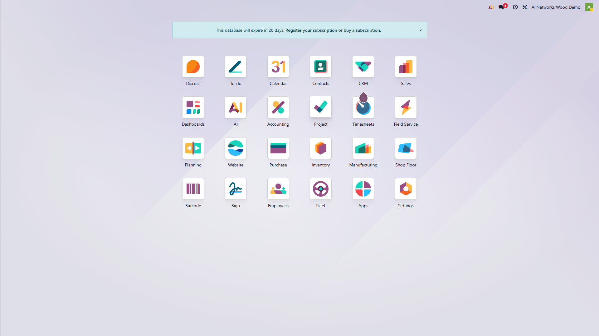
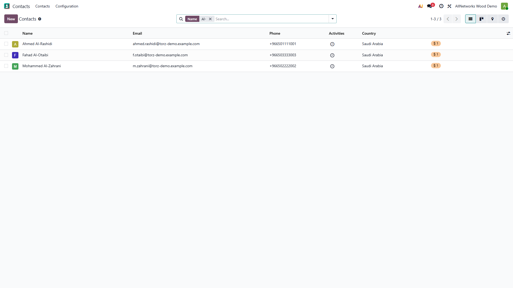
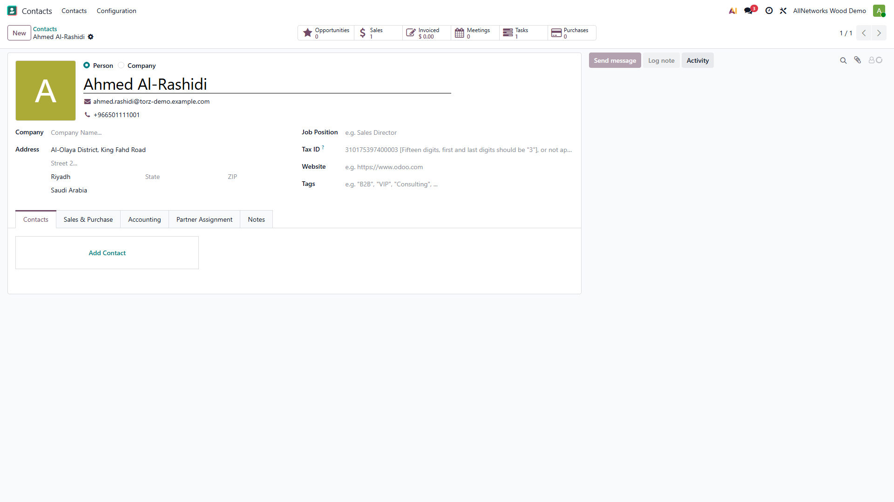
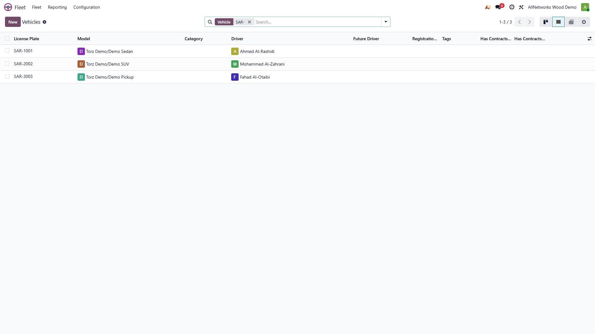
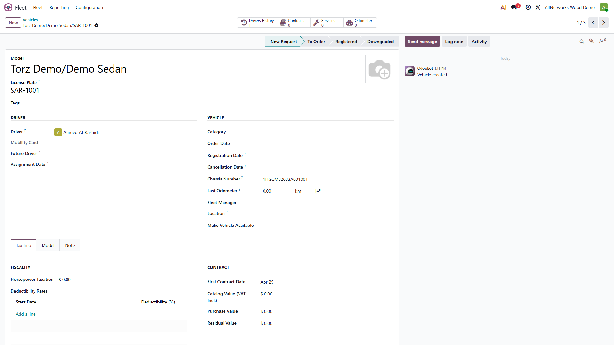
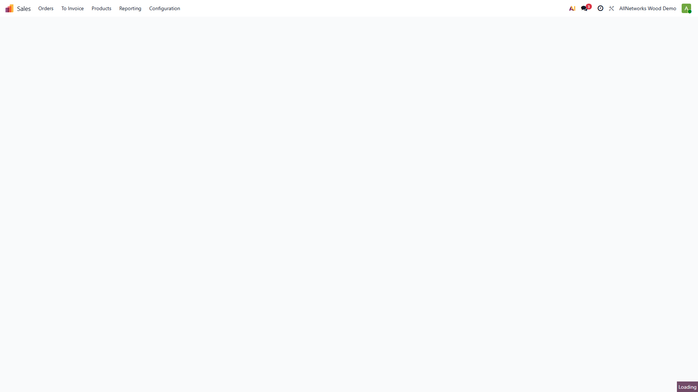
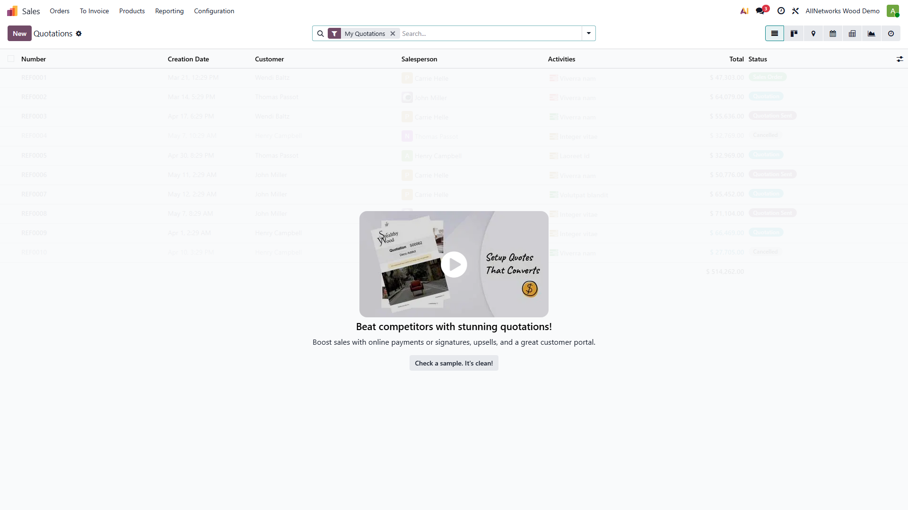
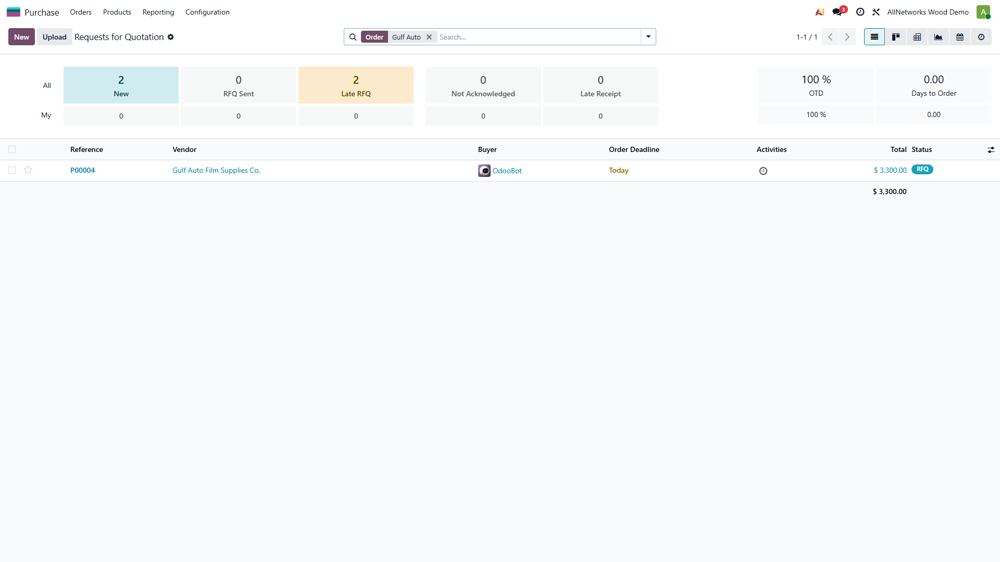
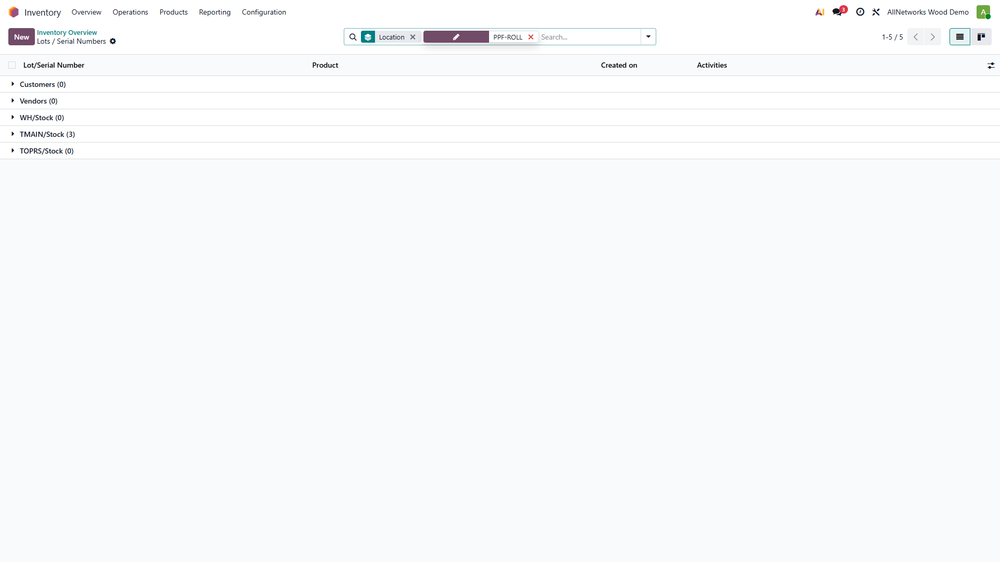

# Torz Trading — Phase 2 Demo Data

**Module:** `torz_demo_standard_workflow`  
**Odoo:** Enterprise 19  
**Author:** Torz Trading / Bright Information  
**Scope:** Transactional demo data that makes the Phase-1 standard workflow fully demonstrable end-to-end.  
**Depends on:** `torz_phase1_workflow`

---

## What this module does

Installs in one click on top of `torz_phase1_workflow` and seeds:

| Data | Detail |
|------|--------|
| Customers | Ahmed Al-Rashidi, Mohammed Al-Zahrani, Fahad Al-Otaibi (Saudi Arabia) |
| Vendor | Gulf Auto Film Supplies Co. (Riyadh) |
| Fleet models | Demo SUV, Demo Pickup (under existing *Torz Demo* brand) |
| Fleet vehicles | SAR-1001 Sedan · SAR-2002 SUV · SAR-3003 Pickup, each linked to a customer |
| Stock lots | PPF-ROLL-2024-001/2/3, TINT-ROLL-2024-001/2 |
| Opening stock (TMAIN) | 6 PPF rolls (lot-tracked), 6 tint rolls (lot-tracked), 10 ceramic bottles |
| Sales Orders | S0001x PPF · S0001x Ceramic · S0001x Tinting — all **confirmed** |
| FSM job cards | Auto-created 1 per SO, staged: Vehicle Received / In Progress / New |
| Purchase Order | Draft PO to vendor — 5 PPF + 4 tint + 10 ceramic (ready to confirm) |

All transactional records (opening stock, SO confirmation, task staging) are applied by a `post_init_hook` — no manual steps needed after installation.

---

## Dependencies

```
sale_management
purchase
stock
account
fleet
industry_fsm_sale
industry_fsm_report
torz_phase1_workflow     ← must be installed first
```

---

## Installation

```bash
# Make sure torz_phase1_workflow is already installed, then:
py -3.12 odoo-bin -c odoo.conf -d <your_db> -i torz_demo_standard_workflow --stop-after-init
```

---

## End-to-end demo scenario

The 10-step walkthrough a trainer runs with this data loaded:

### Step 1 — Login

App menu shows Sales, Field Service, Inventory, Purchase, Fleet.



---

### Step 2 — Demo Customers

Three Saudi customers ready for demo: **Ahmed Al-Rashidi**, **Mohammed Al-Zahrani**, **Fahad Al-Otaibi**.  
Navigate: **Contacts → search `Al-`**



---

### Step 3 — Customer Form

Each customer has phone, email, and a Saudi address. The smart button links to their fleet vehicle.  
Navigate: **Contacts → Ahmed Al-Rashidi**



---

### Step 4 — Fleet Vehicles

Three vehicles registered, one per customer. Filter by `SAR-` to isolate demo records.  
Navigate: **Fleet → Vehicles → search `SAR-`**

| Plate | Model | Driver | Colour |
|-------|-------|--------|--------|
| SAR-1001 | Demo Sedan | Ahmed Al-Rashidi | White |
| SAR-2002 | Demo SUV | Mohammed Al-Zahrani | Black |
| SAR-3003 | Demo Pickup | Fahad Al-Otaibi | Silver |



---

### Step 5 — Vehicle Form

Vehicle details: make/model, colour, VIN, and linked customer.  
Navigate: **Fleet → SAR-1001**



---

### Step 6 — Inventory Overview

Both Torz warehouses are visible: **TMAIN** (main stock) and **TOPRS** (cutting / operations).  
Navigate: **Inventory**


---

### Step 7 — Opening Stock

Opening stock was posted in **TMAIN** by the `post_init_hook` using `stock.quant._update_available_quantity`.  
Navigate: **Inventory → Products → search `Film Roll`**

| Product | Qty | Lots |
|---------|-----|------|
| PPF Film Roll | 6 | PPF-ROLL-2024-001/2/3 |
| Window Tint Film Roll | 6 | TINT-ROLL-2024-001/2 |
| Nano Ceramic Coating Bottle | 10 | — (no lot tracking) |


---

### Step 8 — Confirmed Sales Orders

Three SOs auto-confirmed on install. Each has one service line and a smart button to the FSM job card.  
Navigate: **Sales → Orders**



---

### Step 9 — Sales Order Form (Ahmed — PPF)

SO for Ahmed: Paint Protection Film, 8 hours @ 1,500 SAR. The smart button at top-right links to the Field Service task.  
Navigate: **Sales → Ahmed Al-Rashidi order**


---

### Step 10 — FSM Job Cards — Kanban

Three job cards spread across three stages, giving a realistic workshop snapshot.  
Navigate: **Field Service → Tasks → Kanban view**

| Job card | Customer | Stage |
|----------|----------|-------|
| PPF Full Car | Ahmed Al-Rashidi | **Vehicle Received** |
| Nano Ceramic | Mohammed Al-Zahrani | **In Progress** |
| Window Tinting | Fahad Al-Otaibi | **New** |


---

### Step 11 — FSM Tasks — List View

List view is more practical for filtering, assigning technicians, and bulk stage moves.  
Navigate: **Field Service → Tasks → List view**


---

### Step 12 — Job Card: Vehicle Received Stage

Ahmed's PPF job is waiting for work to start — vehicle has been received.  
Navigate: **Field Service → Tasks → Ahmed's task**


---

### Step 13 — Job Card: In Progress Stage

Mohammed's ceramic job is actively being worked on.  
Navigate: **Field Service → Tasks → Mohammed's task**



---

### Step 14 — Draft Purchase Order

A draft PO to **Gulf Auto Film Supplies Co.** is ready to confirm during a procurement demo.  
Navigate: **Purchase → Orders → search `Gulf Auto`**



---

### Step 14b — Purchase Order Form

Three material lines: PPF rolls, tint rolls, and ceramic bottles.  
Navigate: **Purchase → Gulf Auto Film Supplies order**


---

### Step 15 — Lot / Serial Numbers

Lot-tracked PPF rolls are visible in Inventory. Traceability is live from the moment opening stock was set.  
Navigate: **Inventory → Products → Lots/Serial Numbers → search `PPF-ROLL`**



---

## Full trainer walkthrough (10 steps)

1. **Customer call** → Contacts → Ahmed Al-Rashidi — confirm contact info
2. **Check vehicle** → Fleet → SAR-1001 — confirm it's his white sedan
3. **View SO** → Sales → S0001x — PPF line, 8h × 1,500 SAR, status: Sales Order
4. **Open job card** → smart button → FSM task — stage: Vehicle Received
5. **Log work** → add timesheet line, move task to In Progress
6. **Check stock** → Inventory → TMAIN → 6 PPF rolls available (lot-tracked)
7. **Advance stages** → Quality Check → Ready for Delivery → Delivered
8. **Invoice** → SO → Create Invoice → Confirm → Register Payment
9. **Procurement** → Purchase → confirm PO, receive goods, stock updated in TMAIN
10. **Traceability** → Inventory → Lots → PPF-ROLL-2024-001 → trace usage

---

## File structure

```
torz_demo_standard_workflow/
├── __init__.py
├── __manifest__.py
├── README.md                          ← this file
├── hooks.py                           ← post_init_hook (stock + confirm SOs + stage tasks)
├── data/
│   ├── res_partner_data.xml           ← 3 customers + 1 vendor
│   ├── fleet_vehicle_data.xml         ← 2 fleet models + 3 vehicles
│   ├── stock_lot_data.xml             ← 5 lots (PPF + tint)
│   ├── sale_order_data.xml            ← 3 draft SOs + lines
│   └── purchase_order_data.xml        ← 1 draft PO + 3 lines
└── static/
    └── description/
        ├── 01_home.png
        ├── 02_contacts_demo_customers_list.png
        ├── 03_contact_ahmed_form.png
        ├── 04_fleet_demo_vehicles_list.png
        ├── 05_fleet_sar1001_form.png
        ├── 06_inventory_overview.png
        ├── 07_inventory_onhand_film_rolls.png
        ├── 08_sales_orders_list.png
        ├── 09_so_ahmed_ppf_form.png
        ├── 10_fsm_tasks_kanban.png
        ├── 11_fsm_tasks_list.png
        ├── 12_fsm_task_ahmed_vehicle_received.png
        ├── 13_fsm_task_mohammed_in_progress.png
        ├── 14_purchase_order_list.png
        ├── 14b_purchase_order_form.png
        └── 15_stock_lots_ppf.png
```

---

## Out of scope in Phase 2

The following are planned for Phase 3 (Gap Analysis) and Phase 4 (Fill Gaps):

- Visual car inspection / pre-delivery inspection form
- Warranty registration and automated follow-up engine
- Customer-facing portal for booking and status tracking
- Custom PDF reports with branding
- Automated WhatsApp / SMS status notifications
