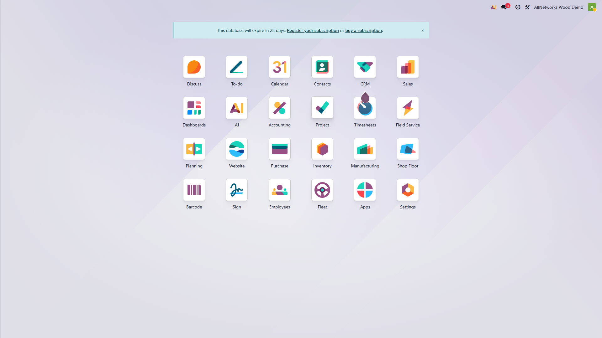
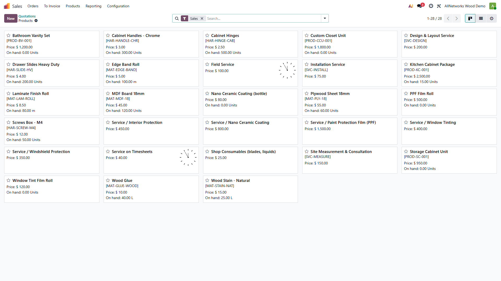
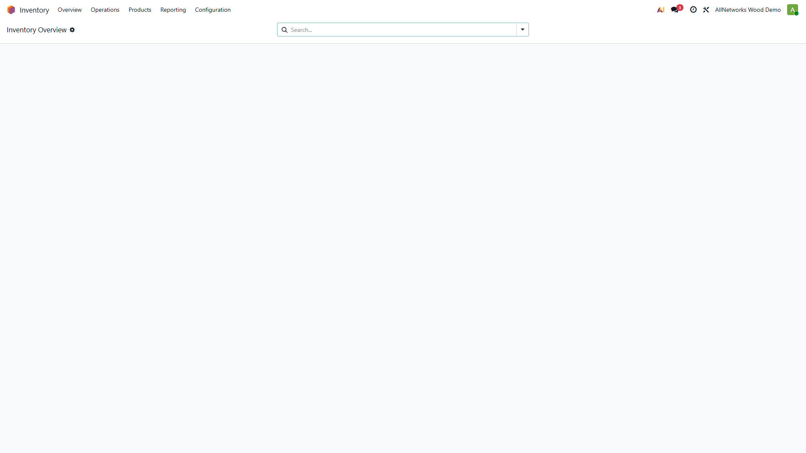
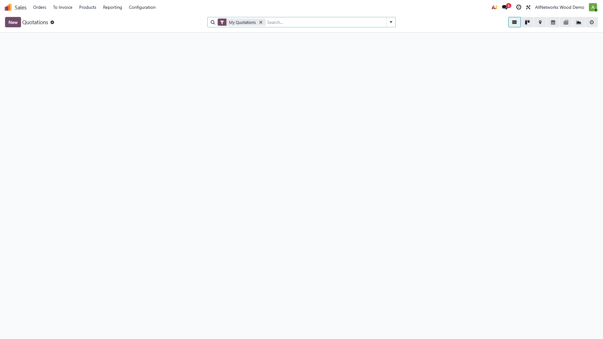
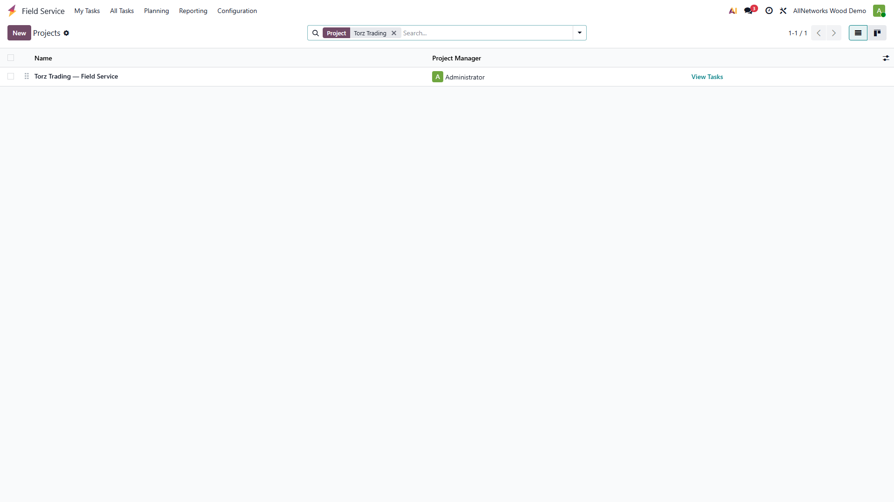
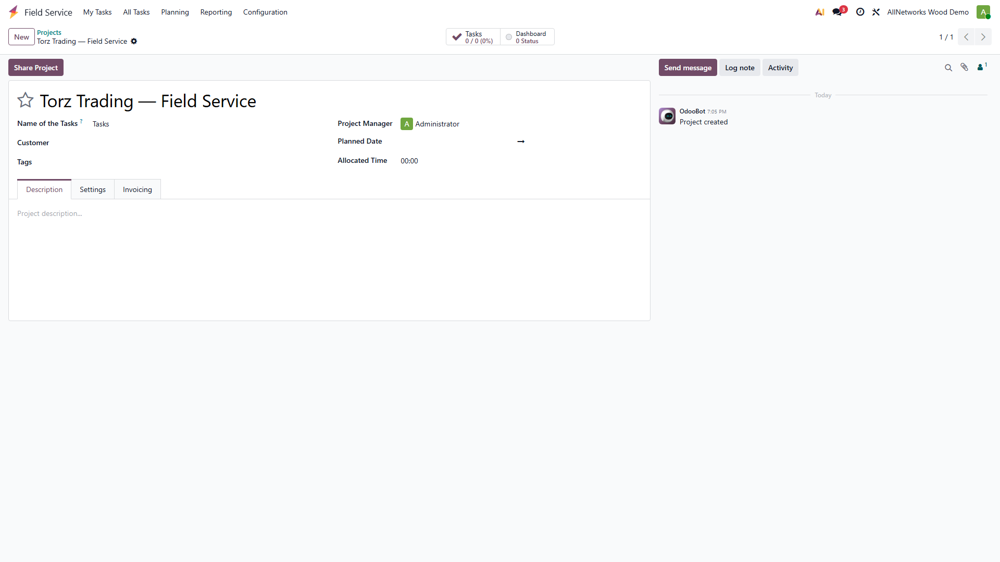
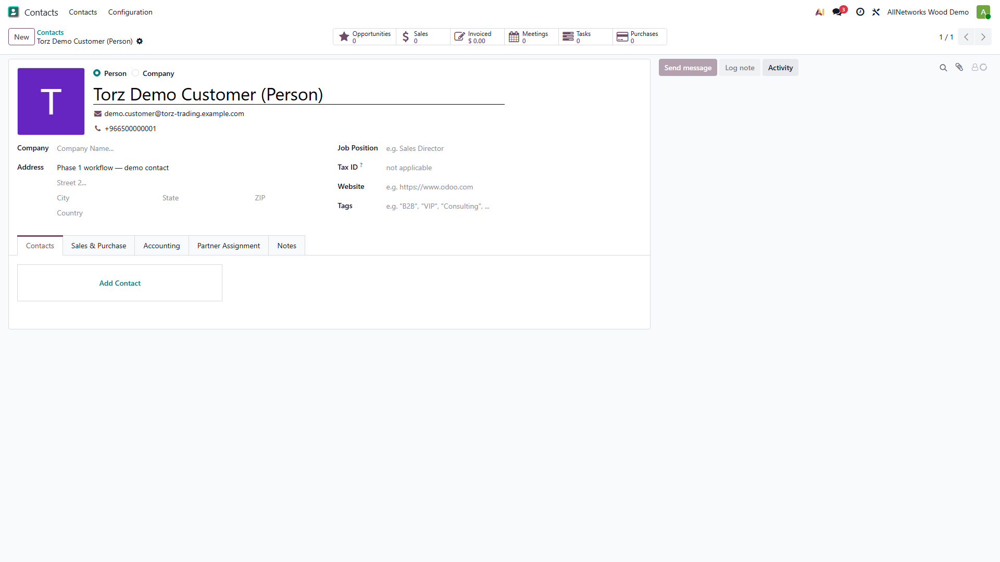

# Torz Trading — Phase 1 Standard Workflow

**Module:** `torz_phase1_workflow`  
**Odoo:** Enterprise 19  
**Author:** Torz Trading / Bright Information  
**Scope:** Master data for the baseline Sales → Field Service → Inventory flow (no custom Python/JS, no gap solutions yet).

---

## What this module does

Installs in one click on a fresh Odoo Enterprise 19 database and seeds:

| Data | Detail |
|------|--------|
| FSM project | *Torz Trading — Field Service* with 7 job-card stages |
| Job-card stages | New → Vehicle Received → In Progress → Quality Check → Ready for Delivery → Delivered → Closed |
| Service products | PPF, Nano Ceramic, Window Tinting, Windshield Protection, Interior Protection |
| Stock products | PPF Film Roll (lot), Tint Film Roll (lot), Ceramic Bottle (storable), Consumables |
| Warehouses | **TMAIN** Torz Main Warehouse · **TOPRS** Torz Cutting / Operations |
| Fleet brand + model | *Torz Demo* brand, *Demo Sedan* model |
| Demo vehicle | Plate `TORZ-DEMO-1`, VIN `DEMO1234567890VIN` |
| Demo customer | *Torz Demo Customer* (person contact, linked as vehicle driver) |
| Worksheet template | *Torz — Car Receiving Report* on `project.task` (extend fields in Studio) |

---

## Dependencies

```
sale_management, purchase, stock, account, fleet,
industry_fsm_sale, industry_fsm_report
```

All are standard **Odoo Enterprise** apps (Field Service + Reports require Enterprise + Studio).

---

## Install

Add the parent folder to `addons_path` in `odoo.conf`, then install the module:

```ini
# odoo.conf
addons_path = ...,D:\odoo\odoo19\projects\bright_information\torz_trading
```

```bash
py -3.12 odoo-bin -c odoo_conf\odoo19.conf -d YOUR_DB -i torz_phase1_workflow --stop-after-init
```

> **Important:** Use Python 3.12 to run the CLI install. Python 3.14 triggers an Odoo 19 registry bug.

---

## Workflow Scenario (end-to-end)

### Step 1 — Login

Log into `cleaning_demo` (or any Enterprise 19 database with this module installed).  
You see the standard Odoo home / app menu.



---

### Step 2 — Register the customer vehicle

Open **Fleet → Vehicles** and find the demo vehicle **TORZ-DEMO-1**.

Fields pre-filled: licence plate, VIN/chassis, brand, model, colour, driver (Torz Demo Customer).

> In production, create a real `fleet.vehicle` record for each new customer car before opening the job card.


---

### Step 3 — Check service products

Open **Sales → Products** and search **Torz** to see the five service products.  
Each is linked to the *Torz Trading — Field Service* project with `task_global_project` tracking — confirming a Sales Order line auto-creates a Field Service task.



---

### Step 4 — Inventory: two-warehouse flow

**Inventory** shows **TMAIN** (Main Warehouse) and **TOPRS** (Cutting / Operations).

Flow:
1. Receive raw materials (PPF rolls, ceramic, tint) into **TMAIN** via Purchase Order.
2. Daily **Internal Transfer** from TMAIN → TOPRS.
3. Consume materials during the job (Products on Task or Inventory Adjustment).
4. Daily **Cycle Count** on TOPRS to reconcile actual vs system stock.



---

### Step 5 — Create a Sales Order → Job Card

1. Go to **Sales → Orders → Quotations** → **New**.
2. Set customer to *Torz Demo Customer*.
3. Add a Torz service product line (e.g. *Paint Protection Film*).
4. **Confirm** the order.

A **Field Service task (job card)** is created automatically in the *Torz Trading — Field Service* project.



---

### Step 6 — Field Service: job card lifecycle

Open **Field Service** and find the new task. Move it through the stages:

```
New
 ↓  Vehicle arrives at workshop
Vehicle Received
 ↓  Technician starts work
In Progress
 ↓  Work complete, supervisor checks
Quality Check
 ↓  Car cleaned, ready to hand over
Ready for Delivery
 ↓  Customer collects
Delivered
 ↓  Admin closes file
Closed
```


---

### Step 7 — FSM project configuration

The project **Torz Trading — Field Service** has:

- `is_fsm = True` (shows in Field Service app)
- `allow_timesheets = True` (log labour hours)
- `allow_billable = True` (link to Sales Order)
- Custom stages loaded by this module





---

### Step 8 — Car Receiving Worksheet

The worksheet template **Torz — Car Receiving Report** is linked to `project.task`.

Open **Field Service → Configuration → Worksheet Templates** and find it, then click **Design** (Studio) to add:

| Field | Type |
|-------|------|
| Plate Number | Char |
| VIN / Chassis | Char |
| Brand / Model | Char |
| Colour | Char |
| Mileage | Integer |
| Fuel Level | Selection (E / 1/4 / 1/2 / 3/4 / F) |
| Exterior checklist | Checkboxes |
| Interior checklist | Checkboxes |
| Accessories received | Text |
| Before-service photos | Image (multiple) |
| After-service photos | Image (multiple) |
| Customer notes | Text |
| Technician notes | Text |
| Customer signature | Signature |
| Receiver signature | Signature |

> This is a **Studio** step, not loaded by the module (Studio fields are DB-specific).


---

### Step 9 — Invoice and payment

Once the task is **Delivered**:

1. Go back to the **Sales Order**.
2. Click **Create Invoice** (invoiced by timesheets or manually).
3. **Confirm** the invoice.
4. **Register Payment** — select bank/cash journal.
5. Use **Accounting → Reporting** for revenue vs cost analysis.

---

### Step 10 — Demo customer contact

The seeded contact **Torz Demo Customer** is ready for test quotations without affecting real data.




---

## File structure

```
torz_phase1_workflow/
├── __init__.py
├── __manifest__.py
├── README.md                          ← this file
├── static/
│   └── description/
│       ├── 01_home_after_login.png
│       ├── 02_fleet_vehicle_list_filtered.png
│       ├── 04_products_torz_search.png
│       ├── 05_inventory_overview.png
│       ├── 06_fsm_tasks_torz_search.png
│       ├── 07_fsm_projects_torz_search.png
│       ├── 07b_fsm_project_form.png
│       ├── 08_sales_orders_list.png
│       ├── 09_worksheet_templates_torz.png
│       ├── 10_contacts_torz_demo_customer.png
│       └── 10b_contacts_torz_demo_customer_form.png
└── data/
    ├── project_fsm_data.xml           FSM project + 7 stages
    ├── stock_warehouse_data.xml       TMAIN + TOPRS warehouses
    ├── product_data.xml               5 service + 4 material products
    ├── res_partner_data.xml           Demo customer contact
    ├── fleet_vehicle_data.xml         Demo brand/model/vehicle
    └── worksheet_template_data.xml    Car Receiving Report template shell
```

---

## What is NOT in this module (Phase 2+)

| Gap | Planned phase |
|-----|--------------|
| Visual car inspection (annotation widget) | Phase 3 / Gap 1 |
| Warranty follow-up engine | Phase 3 / Gap 2 |
| Warranty status (Valid / Expiring / Expired) | Phase 3 / Gap 3 |
| Demo Sales Order + stock opening balances | Phase 2 (demo data module) |

---

## Regenerating screenshots

```powershell
cd D:\odoo\odoo19\projects\bright_information\torz_trading\phase1_doc_playwright
$env:ODOO_PASSWORD = "admin"
npm run capture
# then copy new PNGs from phase1_workflow_docs\screenshots\ to static\description\
```
